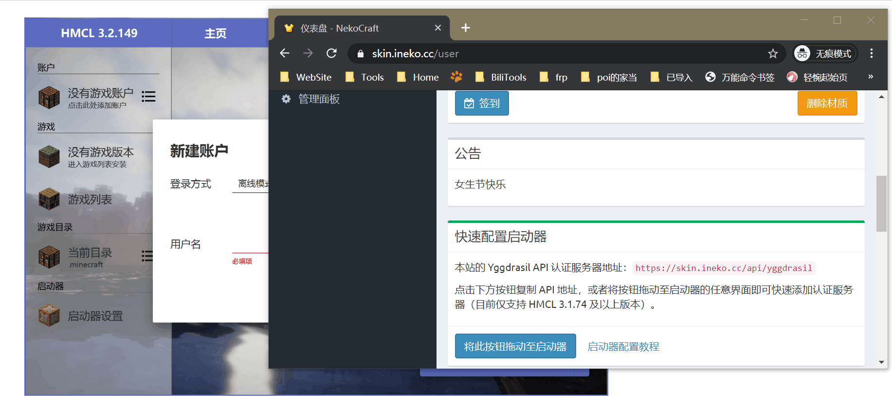
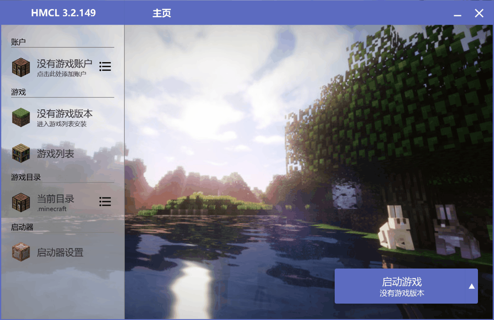
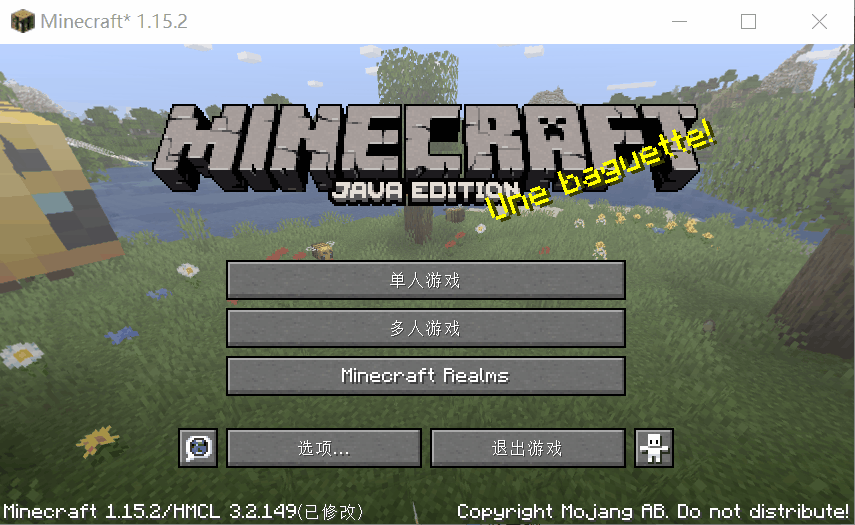

# 设置客户端

#### **如果您在配置过程中遇到了问题，请参阅**[**常见问题**](../problems.md)\*\*\*\*

为了方便管理，所以我们采用了[外置登陆系统](https://printempw.github.io/minecraft-yggdrasil-api-third-party-implementation/)；所以您需要通过一些设置以接入我们。

## \#1 启动器

#### **如果你知道你应该做什么，你可以直接跳转到** [**配置**](setup.md#setup_server)\*\*\*\*

### 支持的启动器 

**如果您没有启动器，请跳转到**[**获取启动器**](setup.md#get_launcher)\*\*\*\*

只要您的启动器带有**外置登录**或**auth-injector**字样的功能，便可以支持我们。

或者，您可以采用我们推荐的[HMCL](https://hmcl.huangyuhui.net/)启动器。

### 获取启动器 

以HMCL举例

打开以下链接以进入启动器的下载网页。



打开以下链接



根据您的操作系统下载对应版本的启动器

如果你不知道操作系统是什么，那请下载**.jar为后缀**的版本



打开以下链接



根据您的操作系统下载对应版本的启动器

如果你不知道操作系统是什么，那请下载**.jar为后缀**的版本



下载完毕后，双击运行启动器，如果能出现以下界面则下载成功。

\*\*\*\*[**遇到问题了？**](../problems.md)\*\*\*\*

## \#2 配置启动器 

**不同启动器配置方式略有差别，请根据实际情况参阅相关文档。**

此处以HMCL举例。

### 获取账号

进入[皮肤](https://skin.ineko.cc)注册账号，**并验证邮箱**。

（可选）选取一个您心仪的皮肤，并应用。

### 接入外置登录服务器

您可以在以下选项卡中选择您喜欢的添加方法



登陆[皮肤站](https://skin.ineko.cc)，进入仪表盘

找到公告下方的**快速配置启动器**

将带有“将此按钮拖动至启动器”标识的蓝色按钮拖动至您的启动器

完成后，点击登陆方式中的下拉选项，选择外置登录（auth-injector\)

接着，输入您注册时使用的邮箱和密码，即可登陆



点击**登陆方式**中的下拉选项，选择**外置登录（auth-injector\)**

单击认证服务器旁的加号，以添加我们的认证服务器

服务器地址为：`https://skin.ineko.cc/api/yggdrasil`

完成后，输入您注册时使用的邮箱和密码，即可登陆



当您看到左侧**账户**一栏出现您**注册时填写的用户名**和**设定的皮肤**时，恭喜你，已经成功接入了我们的外置登录服务器🎇

[遇到问题了？](../problems.md)

## \#3 下载游戏 

#### **不同启动器配置方式略有差别，请根据实际情况参阅相关文档。**

此处以HMCL举例。

**此时，启动器是无法启动游戏的；因为您没有下载任何版本的游戏。**

单击左侧**游戏列表**，然后点击上方**安装新游戏版本**；待加载完毕后即可选择对应版本的游戏下载安装。

**不知道下载哪个版本？请参阅**[**服务器版本**](servers.md)\*\*\*\*

下载过程有些慢，完成后单击开始游戏即可

[遇到问题了？](../problems.md)

## \#4 添加服务器

下载完毕后，单击启动游戏，即可进入熟悉的Minecraft游戏界面。

单击多人游戏→添加服务器，填入我们的[服务器地址](../#server_ip)

至此，客户端配置完毕！

## Enjoy！享受游戏吧🎇 

#### 

